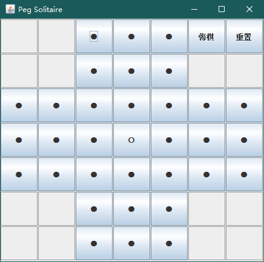
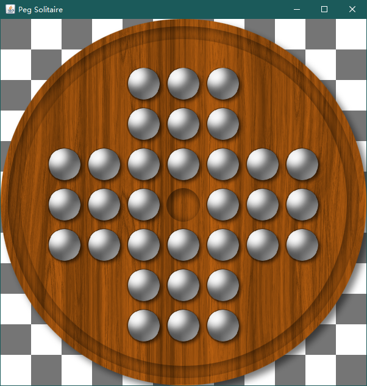
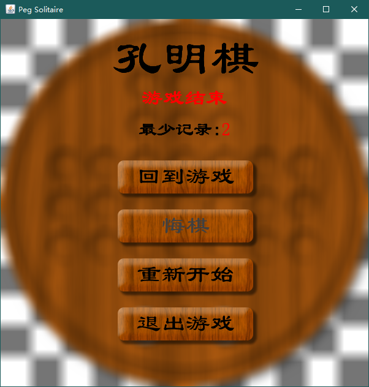

## Dependencies

lib/Filters.jar

lib/sqlite-jdbc-3.30.1.jar

## Current Gui
Stage 1:

Stage 2:

Paused:

## Classes

- package core: the game core

    - **Core**: peg solitaire the game itself.

    - **Board**: game's board.
    
    - **Position**: a simple 2d Point implementation
    
    - **State**: a enum class for each piece's state (disabled/taken/exist)

- package simplegui: early-stage implemented simple gui

    - **Main**: create gui object and launch gui.

    - **Gui**: main gui windows object.

    - **ButtonHandler**: add button to the window and add listener to each button.

    - **ButtonListener**: listen to user's pushing action, pass action to game core.

- package gui: final product for desktop application

    - **Main**: main window, pre-render process and post-render process n' stuff
    
    - **Game**: gui logic and game logic
    
    - **Renderer**: the class that renders the whole game
    
    - **KeyboardManager** & **MouseManager**: the classes that handle mouse and keyboard event
    
    - **Utils**: some useful utilities
    
    - **MenuButton**: the properties of the buttons in the menu
    
    - **SingletonJFrame**: Unused (supposed to be used in custom windows moving)
    
    - **RecordManager**:  the class that manage game record
    
## TODO

- [x] game core
- [x] simple gui
    - [x] buttons for the pieces
    - [x] buttons for take-back and restart functionality
    - [x] added button listener
- [x] final gui
    - [x] Render the game itself
    - [x] make the game playable
    - [x] add blur effect when pressed escape key
    - [x] draw some menu icons/buttons
    - [x] add basic menu rendering
    - [x] add icons/buttons to the menu
    - [x] make the menu clickable
    - [x] optimize performance
    - [x] add game start and game over screen/string
    - [x] add record
- [x] fix bugs / optimize code
