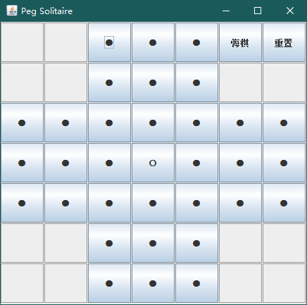
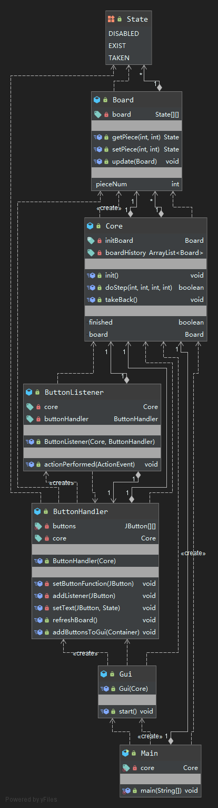

**W.I.P.**

## Current Gui

## Classes

- **Main**: create gui object and launch gui.

- **Gui**: main gui windows object.

- **ButtonHandler**: add button to the window and add listener to each button.

- **ButtonListener**: listen to user's pushing action, pass action to game core.

- **Core**: peg solitaire the game itself.

- **Board**: game's board.

## UML diagram

(auto generated by idea IDE)

